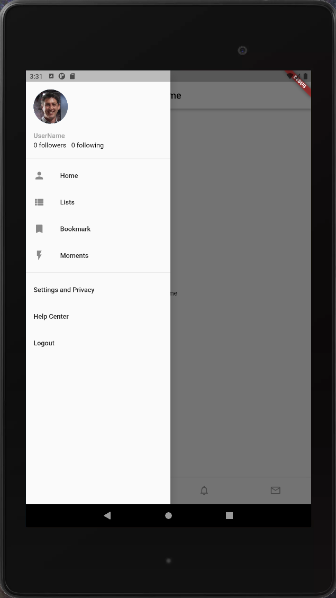

Holberton School Flutter
===========================

This repository contains projects intended to teach the fundamentals of Flutter for Dart. What is flutter? 
>Flutter is Google's portable UI toolkit for crafting beautiful, natively compiled applications for mobile, web, and desktop from a single codebase.

# twitter_clone
- A user friendly app to view your friends and their messages

## Screenshots

  
  
  
  

Installation on Windows:
-----

[See the Flutter docs for full installation instructions](https://docs.flutter.dev/get-started/install/windows)

Contributor
 
[Jay Calhoun](https://www.github.com/Valinor13)